# ChronoSIFT

ChronoSIFT is a deterministic behavioural scoring engine for incident response and post-breach ("dead-box") forensic analysis. It enriches Plaso/log2timeline super-timelines with explainable behavioural signals and weighted scores, using artefacts likely to remain on disk rather than relying on live endpoint state.

> **Project status: work in progress.** ChronoSIFT is a research pipeline component, not a standalone forensic product. It expects upstream timeline extraction, conversion, and enrichment; its output is intended for downstream analysis, visualisation, evaluation, and human evidential validation. Interfaces, rules, weights, and coverage may change as the research develops.

The engine is part of a research pipeline tied to the [MITRE ATT&CK framework](https://attack.mitre.org/). It is designed for heterogeneous forensic timelines where fields may be missing, duplicated, or parser-dependent, and emits analyst-facing explanations alongside every score.

## What it detects

ChronoSIFT combines atomic artefact rules, typed detector policy, temporal relationships, behavioural continuity, and contextual enrichment. Its configurable YAML rules, detector policy, and weights support behaviours including:

- authentication failures, success-after-failure, account pivots, privileged activity, and newly observed users or IPs through first-seen/change rules;
- new cities, countries, and autonomous systems (ASNs), network-boundary changes, private/public IP transitions, and impossible travel;
- suspicious execution, LOLBins, web shells, persistence, credential access, collection, staging, transfer, exfiltration, and impact;
- statistically validated hour-of-week out-of-hours amplification;
- YARA, antivirus, Luhn, known-file, and referenced-file enrichment; and
- direct and composite mappings to ATT&CK techniques that can be evidenced from disk artefacts.

Rules and detector policy define what constitutes a signal; weights define how strongly each signal contributes to a capped event score. They are ordinary YAML and are intended to be adjusted for the investigated environment and research question. See [the rule-language reference](docs/RULE_LANGUAGE.md) and the [dead-box ATT&CK matrix](docs/ATTACK_MATRIX.md).

### Configuration model

ChronoSIFT separates research policy from reusable execution mechanics:

- YAML rules and typed detector definitions own enablement, inputs, detection
  conditions, windows and bounds, emitted signals, confidence, and explanation
  metadata.
- The weights YAML defines how emitted signals contribute to the capped event
  score. Ordinary rule-emission collisions follow the configured merge policy;
  typed detector emissions use idempotent maximum merge.
- Python owns validated mechanics such as canonical parsing, normalisation,
  bounded-window traversal, state handling, and sparse materialisation. It does
  not restore missing detection policy through hidden defaults.
- Rules and weights are strict schemas. Missing required definitions, unknown
  or obsolete keys, duplicate mapping keys, invalid signal dependencies, and
  enabled emissions without weights fail validation.
- Execution order is dependency-checked: classification and atomic signals are
  available before contextual correlation, temporal analysis runs after its
  prerequisites, and trust adjustment and the validated score amplifier run
  only after the complete signal set exists.

The shipped policy contains complete definitions for thirty-five detectors.
Additional detector IDs can use the reusable signal-gate, signal-sequence, or
signal-projection shapes without a new Python branch; a genuinely new detector
shape still requires an executor implementation. Exact schemas, detector IDs,
execution ordering, temporal state semantics, and extension limits are in the
[rule-language reference](docs/RULE_LANGUAGE.md#detector-policy-v1) and
[shipped-policy guide](rules/README.md#authoritative-detector-policy).

## Research context

ChronoSIFT was deliberately implemented with assistance from OpenAI Codex and Anthropic Claude after the synthetic datasets had been created. This separation was intended to reduce the opportunity for researcher expectations about the scenarios to shape detector implementation. AI assistance does not remove bias by itself: rules, outputs, and research conclusions still require human review, testing, and transparent reporting.

Within the wider data pipeline, Plaso/log2timeline extracts the forensic super-timeline; the export is converted to partitioned Parquet; optional YARA, ClamAV, NSRL, GeoLite2, and Luhn stages add evidence and context; ChronoSIFT applies behavioural rules and scoring; and later research stages inspect, visualise, and evaluate the enriched output.

The associated synthetic forensic datasets are available from The Open University:

- [Compromised Windows Server 2022 (simulation)](https://doi.org/10.21954/ou.rd.26038642)
- [Defaced web server (Ubuntu 22.04) (simulation)](https://doi.org/10.21954/ou.rd.26038669)

The datasets are research inputs and are not included in this repository.

## Pipeline stages

ChronoSIFT occupies the behavioural-analysis section of a wider forensic data pipeline. It does not acquire disk images, run Plaso, perform malware scans, or replace evidential review.

```mermaid
flowchart LR
    A["Disk image"] --> B["Plaso super-timeline"]
    B --> C["Partitioned Parquet"]
    C --> D["Normalise and enrich"]
    D --> E["Atomic rules"]
    E --> F["Whole-partition contextual analysis"]
    F --> G["Temporal candidate filtering"]
    G --> H["Temporal and stateful analysis"]
    H --> I["Weighted sidecar output"]
    I --> J["Review, visualisation and research evaluation"]
```



1. **Forensic acquisition and Plaso extraction — upstream.** Plaso/log2timeline
   turns on-disk artefacts into a super-timeline. ChronoSIFT is for post-breach
   triage and prioritisation, not prevention or live monitoring.

2. **Parquet preparation — upstream.** The supplied converter streams the Plaso
   JSONL.XZ export into year/month-partitioned Parquet and assigns a stable
   `chronosift_row_id`. ChronoSIFT processes those partitions incrementally and
   leaves the base timeline unchanged.

3. **Canonicalisation, normalisation, and optional enrichment.** Mandatory YAML
   contracts produce stable authentication, execution, web, path, and network
   fields across heterogeneous parsers. Optional YARA, ClamAV, NSRL, GeoLite2,
   Luhn, and hash inputs add context without becoming standalone verdicts.

4. **Atomic rule evaluation.** Rules evaluate individual events and emit sparse
   signals with explanations. These preserve the source evidence before later
   behavioural interpretation.

5. **Whole-partition contextual and dead-box evaluation.** Contextual passes
   correlate authentication, execution, persistence, file, web, and enrichment
   evidence across the partition. They also validate the activity profile,
   apply configured noise controls, and retain scored or specialised lifecycle
   evidence.

6. **Sparse temporal candidate filtering.** Temporal prerequisites and their
   bounded neighbours are selected without reducing whole-partition
   non-temporal coverage.

7. **Temporal rules and composites.** Bounded state links behaviour within and
   across partitions through sequences, co-occurrence, first-seen values, and
   changes. Examples include failure followed by success, impossible travel,
   download followed by execution, and staging followed by transfer.

8. **Scoring and sidecar output.** Configurable weights produce a capped event
   score. The sidecar preserves stable row keys, sparse signals, and canonical
   JSON explanations; reports, telemetry, and reusable manifests record the
   run's provenance.

**Downstream research — outside this repository.** The sidecar can be joined to the base timeline for analyst review, visualisation, ground-truth evaluation, and later experiments. Within the wider research programme, deterministic behavioural signals may also contribute antigen and danger context to dDCA-based analysis; ChronoSIFT itself remains the explainable behavioural-scoring stage rather than the complete research pipeline.

## Data-derived out-of-hours amplification

ChronoSIFT does not define fixed overnight or weekend periods and no longer
uses hand-tuned detector-family coefficients. Instead, it estimates a
dataset-level 168-bin hour-of-week activity distribution and amplifies scored
events only where the available evidence supports a recurring, confidently
low-activity period.

The shipped policy:

- selects host-resident filesystem activity while excluding configured NSRL
  operating-system material and package/update noise;
- requires at least 100 selected events and three complete calendar weeks after
  discarding boundary weeks;
- holds out each complete week in turn and requires a Laplace-smoothed profile
  fitted on the other weeks to improve logarithmic score over a uniform
  `1/168` reference;
- uses a deterministic 2,000-resample whole-week bootstrap with
  `confidence_level: 0.95` and `random_seed: 0`; and
- fails closed to the neutral multiplier when the filtered profile is too
  small, invalid, inconclusive, or unable to identify an amplifiable hour. It
  does not silently substitute the unfiltered timeline.

Predictive non-uniformity alone is not enough. An accepted profile must also
have at least one hour whose simultaneous upper probability bound is below the
uniform reference. For each accepted hour `h`:

```text
activity_deficit(h) = max(0, 1 - p_upper(h) / (1/168))
multiplier(h)       = 1 + activity_deficit(h)
```

The factor is data-derived and bounded to `[1, 2]`. It is applied once to the
complete weighted event score after trust dampening and before the normal event
score cap. It does not change individual signal values, compound by signal
family, reduce in-hours scores, or create a score on an otherwise unscored
event. A rejected or inconclusive profile is neutral.

Preserve the profile manifest with the rules, weights, and input provenance for
every run. It records:

- selection and fallback history;
- per-hour probabilities, uncertainty bounds, deficits, and factors; and
- weekly validation results, `amplifiable_hour_count`, and
  `simultaneous_upper_radius`.

The factors support within-dataset prioritisation, not comparison between
datasets with different retained event volumes. UTC bins may split local habits
across daylight-saving transitions, and “out of hours” means dataset-relative
off peak rather than a rare-event label. See the [statistical method and
rule-language contract](docs/RULE_LANGUAGE.md#hour-of-week-profiling-and-trust-dampening)
and [forensic data assumptions](docs/FORENSIC_DATA_ASSUMPTIONS.md#hour-of-week-time-basis-and-comparability).

The alternative `full_dataset` action remains available only for an explicitly
different experiment: it removes the parser, filename, and NSRL filters and may
model automated timeline production rather than host-resident activity. Do not
mix the two selection semantics in one results series. Report:

- `selection_mode` and source/selected event counts;
- validation status and reason;
- complete-week count and `amplifiable_hour_count`; and
- `simultaneous_upper_radius`.

## Installation

ChronoSIFT requires Python 3.11 or newer.

```bash
export UV_CACHE_DIR="$HOME/.cache/uv"
export UV_PROJECT_ENVIRONMENT="$HOME/.venvs/phd-codex"
uv sync
```

The explicit local paths are required when the checkout is on an external disk
or SMB share and are safe to use for a local checkout as well. They keep uv's
cache and project environment away from slow or fragile shared-storage I/O.
A conventional `python -m venv`/`pip install -e .` environment remains
supported for local-filesystem installations that do not use uv.

Run the test suite from the repository root:

```bash
uv run python -m unittest discover -s tests -p 'test_*.py' -v
```

Tests that require the complete external YARA Forge bundle are skipped when it is not present.
The current unreleased baseline passes 418 tests, with 8 expected skips when
that external corpus is unavailable.

## Usage

ChronoSIFT does not read a Plaso storage file directly. The research workflow first uses `psort.py` from the pinned Plaso Docker image to export the storage file in JSON Lines format. With the input storage file at `plaso/timeline.plaso`, run:

```bash
docker run --rm \
  -v "$PWD/plaso:/data" \
  log2timeline/plaso:20260119 \
  psort.py --unattended --status_view linear -o json_line \
  -w /data/timeline.jsonl \
  /data/timeline.plaso

xz plaso/timeline.jsonl
```

This produces `plaso/timeline.jsonl.xz`. The Docker bind mount lets `psort.py` write the uncompressed JSONL directly to the host; `xz` then compresses it outside the container. Preserve the Plaso image version and export command with the research provenance for the dataset.

Next, convert the compressed export to the stable, year/month-partitioned Parquet layout used by the engine:

```bash
uv run python jsonl_to_parquet_cli_logging.py \
  plaso/timeline.jsonl.xz \
  plaso/timeline.parquet
```

Process a partitioned Parquet timeline and write a sidecar dataset containing ChronoSIFT-derived columns:

```bash
uv run python run_chronosift_sidecar_cli.py \
  /path/to/plaso.parquet \
  /path/to/chronosift-sidecar.parquet
```

Partition runs omit the score-neutral generic lifecycle payloads by default to
control whole-partition memory use. Add
`--retain-zero-weight-lifecycle-signals` only when an export needs those legacy
`file_created`, `file_modified`, and `file_deleted` entries despite their zero
weights. Scored and specialised lifecycle signals are always retained.

Rules and weights can be replaced at run time:

```bash
uv run python run_chronosift_sidecar_cli.py INPUT OUTPUT \
  --rules-yaml rules/rules_profiled_audited_nsrl_updates_baseline_yara_fixed_v10.yaml \
  --weights-yaml rules/weights_profiled_audited_nsrl_updates_baseline_yara_fixed_v8.yaml
```

Use `--help` for output modes, overlap windows, telemetry, manifests, and optional enrichment paths. ChronoSIFT does not run Plaso or scan evidence itself; it consumes timeline fields and hash-indexed enrichment produced by the surrounding forensic pipeline.

### Corpus amplifier telemetry

Each sidecar run writes a `profile_validation` telemetry event and carries the
same compact record into its reports and `.telemetry.summary.json`. It records:

- `selection_mode`, validation status, and reason;
- source and selected event counts;
- complete-week and amplifiable-hour counts plus the simultaneous uncertainty
  radius; and
- whether the amplifier engaged.

Engagement means that validation was accepted and at least one hour received a
factor greater than one; it does not mean that every scored event was
amplified.
An ablation with `profiling.hour_of_week.enabled: false` instead records
`selection_mode: disabled` and `reason: profiling_disabled`. It is therefore a
deliberate known non-engagement, not an unexplained profile rejection.

Aggregate one telemetry stream per image after a batch run:

```bash
uv run python summarize_chronosift_telemetry.py \
  /path/to/corpus/*.telemetry.jsonl \
  --json-out /path/to/corpus/amplifier-engagement.summary.json
```

The resulting `amplifier_engagement` object reports:

- complete, incomplete, known, engaged, and non-engaged run counts;
- the known-run denominator and engagement rate;
- selection, validation, and non-engagement reason counts;
- complete-week and amplifiable-hour summaries; and
- one auditable record per input image.

Incomplete runs, missing profile events, and legacy records without
`amplifiable_hour_count` are reported as unknown and excluded from the rate
denominator. Preserve the aggregate with the per-image manifests so every count
remains traceable to its profile decision.

Summaries use the portable basenames `telemetry_file` and `dataset_name`; they
do not archive resolved filesystem paths. Input telemetry basenames must be
unique so those identifiers remain unambiguous. The raw JSONL retains the
original `dataset_root` when full execution provenance is required.

Corpus summarisation is intentionally all-or-nothing. Every input is parsed and
validated before `--json-out` is written; malformed JSON, duplicate identities,
duplicate profile events, invalid field types, or inconsistent engagement abort
the command instead of producing a partial rate. The error identifies the
offending path (and line for malformed JSON). Run this command as the telemetry
preflight before downstream table generation; it reads the compact telemetry
files rather than the source timelines.

## Optional enrichment data

External databases and generated scan results are intentionally not bundled:

- [YARA Forge](https://github.com/YARAHQ/yara-forge) rule metadata can refine YARA matches into categories such as offensive tooling, ransomware, web shells, APT, exploits, and malware. The shipped detector policy authoritatively defines classification, scoring, emissions, evidence, and the web/hash qualification gate. Supply the downloaded `.yar` file with `--yara-metadata-path`; ChronoSIFT does not redistribute the upstream corpus.
- [ClamAV](https://www.clamav.net/) scan results can be supplied as a hash-keyed CSV with `--av-csv-path`. The shipped detector policy authoritatively maps signature names into malware and tooling categories; see the [ClamAV classification reference](docs/CLAMAV_ENRICHMENT.md).
- The [NIST National Software Reference Library](https://www.nist.gov/itl/ssd/software-quality-group/national-software-reference-library-nsrl) (NSRL) can be supplied with `--nsrl-parquet-path` to identify known software and reduce routine operating-system noise. ChronoSIFT does not consume the original NSRL RDS distribution directly: prepare a SHA-256-indexed Parquet lookup first.
- [MaxMind GeoLite2](https://dev.maxmind.com/geoip/geolite2-free-geolocation-data) City and ASN databases can be supplied with `--geoip-city-db` and `--geoip-asn-db` for country, city, ASN, boundary-crossing, novelty, and impossible-travel features. Output names and continuity bindings are owned and cross-validated by the rules YAML.
- Optional Luhn findings can be supplied as a hash-keyed CSV with `--luhn-csv-path`.

See [rules/README.md](rules/README.md) for expected file schemas, the [YARA enrichment reference](docs/YARA_ENRICHMENT.md), and the [ClamAV classification reference](docs/CLAMAV_ENRICHMENT.md) for scoring details. Each external resource remains subject to its own licence and terms.

## Reproducibility and limitations

ChronoSIFT is a research engine, not a verdict generator. A high score prioritises an event for investigation; it does not prove maliciousness. Coverage depends on source retention, Plaso parser coverage, enrichment currency, configuration, and the evidential artefacts available in the image. Preserve timestamps in UTC, record the rules and weights used for every run, and validate important findings against the underlying artefacts.

The engine records reproducibility metadata and can emit reports, stage telemetry, a profile manifest, and a referenced-file hit manifest. Sidecar mode preserves the base timeline and writes only stable keys plus derived enrichment and scoring columns.

Hour-of-week profiles use UTC weekday/hour bins. Local habits spanning a
daylight-saving transition can be split across adjacent UTC bins, weakening
the profile. The conservative uncertainty band also narrows with evidence
volume, so otherwise similar datasets can receive different out-of-hours
factors. Treat those factors as within-dataset prioritisation values, preserve
the complete profile manifest, and see the
[forensic data assumptions](docs/FORENSIC_DATA_ASSUMPTIONS.md) before making
cross-dataset comparisons.

### Referenced-file and web evidence

The referenced-file manifest connects filesystem evidence to later web
activity without reducing it to an undifferentiated hit:

- configured document roots map filesystem paths to canonical URL paths, so a
  later request can inherit qualified Luhn, antivirus, or YARA evidence;
- AV signatures, families, and categories and qualified YARA names, categories,
  scores, and quality remain attributable;
- qualification is tracked per SHA-256, resolved hashes take precedence over
  upload names, and ambiguous URL aliases or basenames are omitted rather than
  merged; and
- schema, policy, enrichment, and source digests determine whether a reusable
  manifest remains valid.

Build a manifest per evidence image and configure document roots narrowly.
Weak or unindexed YARA remains available as raw filesystem evidence but cannot
qualify web or upload correlation under the shipped policy. Upload outcomes
distinguish accepted, redirected, rejected, and status-unknown requests.

The dataset source digest uses Parquet membership, file size, and nanosecond
modification time rather than hashing the complete corpus. Rebuild explicitly
after replacing Parquet bytes while preserving those metadata values. The
[detector-policy reference](docs/RULE_LANGUAGE.md#detector-policy-v1) documents
the exact identity, multipart, MIME, outcome, and merge rules.

### Web attack interpretation

- Broken-quote scanner probes without valid injection syntax emit only the
  low-confidence `web_injection_probe`; they do not imply successful
  exploitation.
- `web_sqli_attempt` records high-confidence decoded SQL injection syntax.
  `web_sqli_probable_success` additionally requires HTTP 2xx and a response
  anomaly against successful non-SQLi requests in the configured baseline
  group. Response size alone is never treated as success.
- Evidence-qualified ATT&CK mappings are score-neutral: exploitation syntax
  maps to T1190, accessed independently classified web shells to T1505.003,
  accepted malicious uploads to T1105, and qualifying probable SQLi success to
  T1213.006.

## Documentation

- [Rule language and configuration contract](docs/RULE_LANGUAGE.md)
- [Shipped rules, weights, and optional input schemas](rules/README.md)
- [Forensic data assumptions](docs/FORENSIC_DATA_ASSUMPTIONS.md)
- [Threat model](docs/THREAT_MODEL.md)
- [Dead-box ATT&CK coverage matrix](docs/ATTACK_MATRIX.md)
- [YARA enrichment](docs/YARA_ENRICHMENT.md)
- [ClamAV enrichment](docs/CLAMAV_ENRICHMENT.md)
- [Changelog](CHANGELOG.md) and [citation metadata](CITATION.cff)

## Acknowledgements

ChronoSIFT builds on the work of the Plaso/log2timeline community, MITRE ATT&CK, YARA Forge and its contributing rule authors, ClamAV, NIST NSRL, and MaxMind GeoLite2.

Development used OpenAI Codex and Anthropic Claude. [OpenWolf](https://github.com/cytostack/openwolf) provided persistent project context, reduced repeated file reads and token usage, and made the AI-assisted coding workflow easier to manage.

## Licence

Copyright © 2026 Benjamin Donnachie.

ChronoSIFT is licensed under the [Creative Commons Attribution-NonCommercial-ShareAlike 4.0 International Licence](https://creativecommons.org/licenses/by-nc-sa/4.0/) (CC BY-NC-SA 4.0). See [LICENSE.md](LICENSE.md).

Third-party tools, databases, datasets, rule collections, and marks referenced by this project are not relicensed by this repository and remain subject to their respective terms.
