# ChronoSIFT

ChronoSIFT is a deterministic behavioural scoring engine for incident response and post-breach ("dead-box") forensic analysis. It enriches Plaso/log2timeline super-timelines with explainable behavioural signals and weighted scores, using artefacts likely to remain on disk rather than relying on live endpoint state.

> **Project status: work in progress.** ChronoSIFT is a research pipeline component, not a standalone forensic product. It expects upstream timeline extraction, conversion, and enrichment; its output is intended for downstream analysis, visualisation, evaluation, and human evidential validation. Interfaces, rules, weights, and coverage may change as the research develops.

The engine is part of a research pipeline tied to the [MITRE ATT&CK framework](https://attack.mitre.org/). It is designed for heterogeneous forensic timelines where fields may be missing, duplicated, or parser-dependent, and emits analyst-facing explanations alongside every score.

## What it detects

ChronoSIFT combines atomic artefact rules, temporal relationships, behavioural continuity, and contextual enrichment. Its configurable YAML rules and weights support behaviours including:

- authentication failures, success-after-failure, account pivots, privileged activity, and newly observed users or IPs through first-seen/change rules;
- new cities, countries, and autonomous systems (ASNs), network-boundary changes, private/public IP transitions, and impossible travel;
- suspicious execution, LOLBins, web shells, persistence, credential access, collection, staging, transfer, exfiltration, and impact;
- quiet-time and hour-of-week rarity profiling;
- YARA, antivirus, Luhn, known-file, and referenced-file enrichment; and
- direct and composite mappings to ATT&CK techniques that can be evidenced from disk artefacts.

Rules define what constitutes a signal; weights define how strongly each signal contributes to a capped event score. Both are ordinary YAML and are intended to be adjusted for the investigated environment and research question. See [the rule-language reference](docs/RULE_LANGUAGE.md) and the [dead-box ATT&CK matrix](docs/ATTACK_MATRIX.md).

## Research context

ChronoSIFT was deliberately implemented with assistance from OpenAI Codex and Anthropic Claude after the synthetic datasets had been created. This separation was intended to reduce the opportunity for researcher expectations about the scenarios to shape detector implementation. AI assistance does not remove bias by itself: rules, outputs, and research conclusions still require human review, testing, and transparent reporting.

Within the wider data pipeline, Plaso/log2timeline extracts the forensic super-timeline; the export is converted to partitioned Parquet; optional YARA, ClamAV, NSRL, GeoLite2, and Luhn stages add evidence and context; ChronoSIFT applies behavioural rules and scoring; and later research stages inspect, visualise, and evaluate the enriched output.

The associated synthetic forensic datasets are available from The Open University:

- [Compromised Windows Server 2022 (simulation)](https://doi.org/10.21954/ou.rd.26038642)
- [Defaced web server (Ubuntu 22.04) (simulation)](https://doi.org/10.21954/ou.rd.26038669)

The datasets are research inputs and are not included in this repository.

## Pipeline stages

ChronoSIFT occupies the behavioural-analysis section of a wider forensic data pipeline. It does not acquire disk images, run Plaso, perform malware scans, or replace evidential review.

```mermaid
flowchart LR
    A["Disk image"] --> B["Plaso super-timeline"]
    B --> C["Partitioned Parquet"]
    C --> D["Normalise and enrich"]
    D --> E["Atomic rules"]
    E --> F["Whole-partition contextual analysis"]
    F --> G["Temporal candidate filtering"]
    G --> H["Temporal and stateful analysis"]
    H --> I["Weighted sidecar output"]
    I --> J["Review, visualisation and research evaluation"]
```



1. **Forensic acquisition and Plaso extraction — upstream.** Disk images are processed with Plaso/log2timeline to create a homogeneous super-timeline from heterogeneous on-disk artefacts. ChronoSIFT is intended for post-breach triage and artefact prioritisation, not prevention or live endpoint monitoring.

2. **Parquet preparation — upstream.** The Plaso timeline is exported as JSONL; the supplied converter streams an XZ-compressed export into year/month-partitioned Parquet and assigns a stable `chronosift_row_id`. The base Parquet dataset is preserved so later sidecars can be joined without rebuilding or duplicating the timeline. ChronoSIFT then processes partitions incrementally with DuckDB/Arrow rather than holding the complete super-timeline in memory.

3. **Normalisation and optional enrichment.** Each partition is normalised into stable fields. Structured values are preferred, aliases are coalesced, placeholder values become semantic nulls, and message parsing is used only when parsers do not expose the required field. Web rows expose typed `chronosift_web_*` features for method, host, decoded query, canonical endpoint, source, status, response size, upload name, content type, attack indicators, file identity, and qualified outcome. Optional YARA Forge metadata, ClamAV results, NSRL known-file data, GeoLite2 City/ASN data, Luhn findings, and hash evidence add context without becoming standalone verdicts.

4. **Atomic rule evaluation.** YAML-configured rules evaluate individual events and emit sparse source/evidence signals with explanations. These signals preserve provenance—for example authentication, execution, persistence, file lifecycle, transfer, YARA, or AV evidence—before broader behavioural interpretation.

5. **Whole-partition contextual and dead-box evaluation.** ChronoSIFT builds canonical authentication and execution semantics, propagates referenced-file hits, profiles activity by hour of week, applies noise dampening, and detects artefact patterns that can be supported from disk without volatile memory or live session telemetry. A per-partition working cache reuses normalised arrays between passes without copying the DataFrame, while conservative vector masks keep direct detectors from repeatedly interpreting rows that cannot match. Generic `file_created`, `file_modified`, and `file_deleted` entries are omitted in partition mode when their configured weight is zero; scored and specialised lifecycle detections are always retained.

6. **Sparse temporal candidate filtering.** Rows carrying a temporal prerequisite, plus the bounded neighbouring windows needed for correlation, are selected for temporal/stateful passes when the configured rules make reduction safe. Whole-partition non-temporal coverage is therefore preserved while avoiding a full-partition temporal replay where it adds no evidence.

7. **Temporal rules and composites.** Stateful bounded windows link behaviour within and across Parquet partitions. Supported modes include ordered sequences, co-occurrence, first-seen values, and changed values. This enables behaviours such as failure followed by success, newly observed users or IPs, new countries/ASNs, impossible travel, download followed by execution, credential access followed by staging or transfer, and ransomware or web-shell composites.

8. **Scoring and sidecar output.** Configurable weights convert emitted signals into a capped event score. ChronoSIFT writes a sidecar Parquet dataset keyed by `chronosift_row_id`, preserving signals, scores, and explain evidence while leaving the base timeline unchanged. Across every partition, `chronosift_signals` has the stable Arrow type `MAP<string,double>` and `chronosift_explain` is a stable list of canonical JSON evidence entries; the built-in loaders restore the familiar Python dict/list representation. Reports, telemetry, and reusable profile/file-hit manifests can be retained with the rules, weights, and enrichment versions used for the run.

**Downstream research — outside this repository.** The sidecar can be joined to the base timeline for analyst review, visualisation, ground-truth evaluation, and later experiments. Within the wider research programme, deterministic behavioural signals may also contribute antigen and danger context to dDCA-based analysis; ChronoSIFT itself remains the explainable behavioural-scoring stage rather than the complete research pipeline.

## Installation

ChronoSIFT requires Python 3.11 or newer.

```bash
export UV_CACHE_DIR="$HOME/.cache/uv"
export UV_PROJECT_ENVIRONMENT="$HOME/.venvs/phd-codex"
uv sync
```

The explicit local paths are required when the checkout is on an external disk
or SMB share and are safe to use for a local checkout as well. They keep uv's
cache and project environment away from slow or fragile shared-storage I/O.
A conventional `python -m venv`/`pip install -e .` environment remains
supported for local-filesystem installations that do not use uv.

Run the test suite from the repository root:

```bash
uv run python -m unittest discover -s tests -p 'test_v231_*.py' -v
```

Tests that require the complete external YARA Forge bundle are skipped when it is not present.

## Usage

ChronoSIFT does not read a Plaso storage file directly. The research workflow first uses `psort.py` from the pinned Plaso Docker image to export the storage file in JSON Lines format. With the input storage file at `plaso/timeline.plaso`, run:

```bash
docker run --rm \
  -v "$PWD/plaso:/data" \
  log2timeline/plaso:20260119 \
  psort.py --unattended --status_view linear -o json_line \
  -w /data/timeline.jsonl \
  /data/timeline.plaso

xz plaso/timeline.jsonl
```

This produces `plaso/timeline.jsonl.xz`. The Docker bind mount lets `psort.py` write the uncompressed JSONL directly to the host; `xz` then compresses it outside the container. Preserve the Plaso image version and export command with the research provenance for the dataset.

Next, convert the compressed export to the stable, year/month-partitioned Parquet layout used by the engine:

```bash
uv run python jsonl_to_parquet_cli_logging.py \
  plaso/timeline.jsonl.xz \
  plaso/timeline.parquet
```

Process a partitioned Parquet timeline and write a sidecar dataset containing ChronoSIFT-derived columns:

```bash
uv run python run_chronosift_sidecar_cli.py \
  /path/to/plaso.parquet \
  /path/to/chronosift-sidecar.parquet
```

Partition runs omit the score-neutral generic lifecycle payloads by default to
control whole-partition memory use. Add
`--retain-zero-weight-lifecycle-signals` only when an export needs those legacy
`file_created`, `file_modified`, and `file_deleted` entries despite their zero
weights.

Rules and weights can be replaced at run time:

```bash
uv run python run_chronosift_sidecar_cli.py INPUT OUTPUT \
  --rules-yaml rules/rules_profiled_audited_nsrl_updates_baseline_yara_fixed_v10.yaml \
  --weights-yaml rules/weights_profiled_audited_nsrl_updates_baseline_yara_fixed_v8.yaml
```

Use `--help` for output modes, overlap windows, telemetry, manifests, and optional enrichment paths. ChronoSIFT does not run Plaso or scan evidence itself; it consumes timeline fields and hash-indexed enrichment produced by the surrounding forensic pipeline.

## Optional enrichment data

External databases and generated scan results are intentionally not bundled:

- [YARA Forge](https://github.com/YARAHQ/yara-forge) rule metadata can refine YARA matches into categories such as offensive tooling, ransomware, web shells, APT, exploits, and malware. Supply the downloaded `.yar` file with `--yara-metadata-path`. ChronoSIFT reads additional rule metadata; it does not redistribute the upstream corpus.
- [ClamAV](https://www.clamav.net/) scan results can be supplied as a hash-keyed CSV with `--av-csv-path`. Signature names are parsed into malware and tooling categories for richer output.
- The [NIST National Software Reference Library](https://www.nist.gov/itl/ssd/software-quality-group/national-software-reference-library-nsrl) (NSRL) can be supplied with `--nsrl-parquet-path` to identify known software and reduce routine operating-system noise. ChronoSIFT does not consume the original NSRL RDS distribution directly: prepare a SHA-256-indexed Parquet lookup first.
- [MaxMind GeoLite2](https://dev.maxmind.com/geoip/geolite2-free-geolocation-data) City and ASN databases can be supplied with `--geoip-city-db` and `--geoip-asn-db` for country, city, ASN, boundary-crossing, novelty, and impossible-travel features.
- Optional Luhn findings can be supplied as a hash-keyed CSV with `--luhn-csv-path`.

See [rules/README.md](rules/README.md) for expected file schemas and [the enrichment documentation](docs/YARA_ENRICHMENT.md) for scoring details. Each external resource remains subject to its own licence and terms.

## Reproducibility and limitations

ChronoSIFT is a research engine, not a verdict generator. A high score prioritises an event for investigation; it does not prove maliciousness. Coverage depends on source retention, Plaso parser coverage, enrichment currency, configuration, and the evidential artefacts available in the image. Preserve timestamps in UTC, record the rules and weights used for every run, and validate important findings against the underlying artefacts.

The engine records reproducibility metadata and can emit reports, stage telemetry, a profile manifest, and a referenced-file hit manifest. Sidecar mode preserves the base timeline and writes only stable keys plus derived enrichment and scoring columns.

Referenced-file manifest schema v4 also maps configured web document roots to canonical
URL paths. This lets Apache, nginx, IIS/MS-IIS, and W3C requests inherit Luhn,
antivirus, or sufficiently strong/category-relevant YARA support from the file
they access, even when the request is much later than the filesystem event.
The propagated identity preserves AV signatures, families and categories plus
YARA rule names, categories, scores and quality, rather than reducing evidence
to an undifferentiated hit flag.
Query strings and fragments do not affect identity matching. Successful
Luhn-positive GET responses are identified separately from failed or
status-unknown access, and explicit POST/PUT/PATCH upload filenames can inherit
strong malware-file support. Where parsers expose structured request metadata,
ChronoSIFT recovers multiple multipart names (including RFC 5987 `filename*`),
part MIME types, content length, and SHA-256 values using bounded extraction.
Hash and basename correlation are applied independently and their evidence is
combined, so a SHA-256 match contributes file identity even when the recorded
upload name does not match, and vice versa. Upload outcomes distinguish
accepted, redirected, rejected, and status-unknown requests.

Web requests are also checked for decoded, high-confidence SQL injection
syntax. `web_sqli_attempt` records the request evidence. ChronoSIFT emits the
stronger `web_sqli_probable_success` only when the server returns 2xx and the
response is substantially larger than successful non-SQLi responses for the
same host, method and canonical endpoint. Response size alone is never interpreted as SQLi
success, and redirects or errors remain attempts.

Evidence-qualified ATT&CK labels are emitted separately from scored source
signals: exploitation syntax maps to T1190 without implying success; an
independently classified web shell that is accessed maps to T1505.003; an
accepted malicious inbound upload maps to T1105; and probable successful SQLi carrying
database-enumeration or file-access syntax maps to T1213.006. These mapping
signals have zero weight to avoid counting the same evidence twice.

## Acknowledgements

ChronoSIFT builds on the work of the Plaso/log2timeline community, MITRE ATT&CK, YARA Forge and its contributing rule authors, ClamAV, NIST NSRL, and MaxMind GeoLite2.

Development used OpenAI Codex and Anthropic Claude. [OpenWolf](https://github.com/cytostack/openwolf) provided persistent project context, reduced repeated file reads and token usage, and made the AI-assisted coding workflow easier to manage.

## Licence

Copyright © 2026 Benjamin Donnachie.

ChronoSIFT is licensed under the [Creative Commons Attribution-NonCommercial-ShareAlike 4.0 International Licence](https://creativecommons.org/licenses/by-nc-sa/4.0/) (CC BY-NC-SA 4.0). See [LICENSE.md](LICENSE.md).

Third-party tools, databases, datasets, rule collections, and marks referenced by this project are not relicensed by this repository and remain subject to their respective terms.
